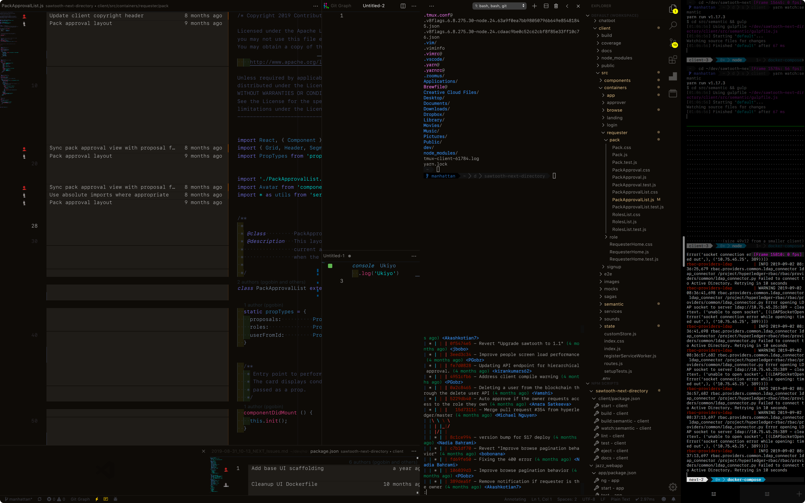
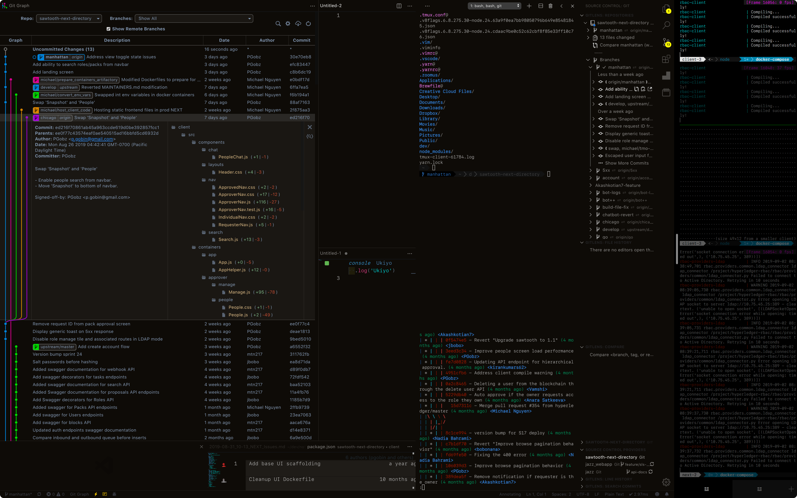
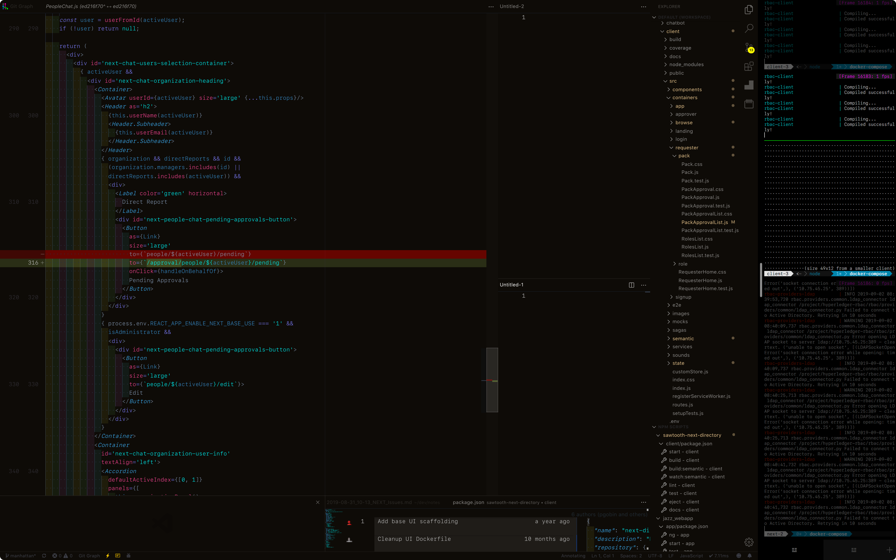

# Ukiyo ☳

<p align="center" style="padding: 9em 0">
  
</p>

**Ukiyo** is a beautiful fucking development environment.

Run `./ukiyo` and smoke a cigarette.

## What is this?
**Ukiyo** assumes you understand that **Visual Studio Code + iTerm** is the best development combo, and that you want one perfect fucking bootstrap script to set up everything configuration-related on a new MacOS (tested on Mojave) dev machine. It is a small shell script that uses [mackup](https://github.com/lra/mackup) and is the seed for the perfect development experience on MacOS.

Run this fucking script, smoke a cigarette, and come back to your new dev environment. Realize how awesome it is to type `backup` in a terminal on one machine, go to another machine and run `./ukiyo` and see the exact same shit.

**Ukiyo** includes classy, utilitarian defaults like powerlined **tmux** and **vim**, `pyenv` + `n`, et al. installed through `brew`. Ukiyo Dark is based on [Kay Dark](https://marketplace.visualstudio.com/items?itemName=kube.theme-kay).

**Note:** This will overwrite your existing dev configuration without prompting. Please backup everything you want to keep.

## Syncs by default


### Apps

- iTerm
- Visual Studio Code + Extensions

### Tools
- bash
- brew
- docker
- git
- npm
- powerline
- ssh
- tmux
- vim
- yarn


**Default synced files:** `.bash_profile`, `.vimrc`, `.tmux.conf`, `.vscode`, `com.googlecode.iterm2.plist`, `keybindings.json`, `settings.json`, `Brewfile`, `.config/powerline`, and Visual Studio Code extensions.

## Installation
1. Clone to a **Dropbox**, **Google Drive**, **iCloud**, or **Copy** folder.
    - (Or a regular file system folder if you don't want syncing across machines)
2. Edit `backup/.mackup.cfg` and provide the path to your cloned folder.
    - If not using Dropbox:
        >```
        >[storage]
        >engine = [ icloud | google_drive | copy | file_system ] # Choose one
        >directory = .config/mackup
        >```
        See [here](https://github.com/lra/mackup/tree/master/doc) for a quick rundown.
3. Install [Visual Studio Code](https://code.visualstudio.com/download).
4. Install [iTerm](https://www.iterm2.com/downloads.html).
5. Run `./ukiyo`.
6. 🚬

## Screencaps

<p align="center" style="padding: 9em 0">
  
</p>
<p align="center" style="padding: 9em 0">
  
</p>
<p align="center" style="padding: 9em 0">
  
</p>

## ☳
