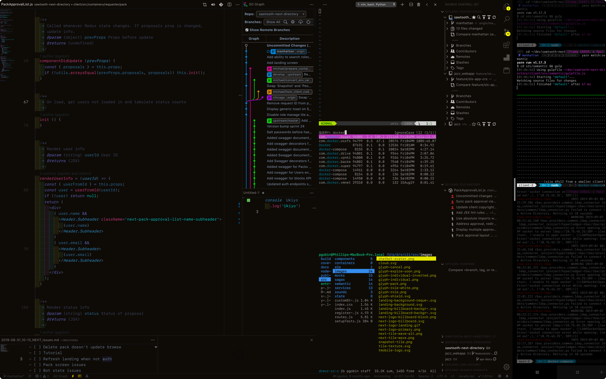

# Ukiyo ☳

<p align="center" style="padding: 9em 0">
  
</p>

## Overview
Small shell script that uses [mackup](https://github.com/lra/mackup).

Powerlined **tmux** and **vim**, `pyenv` + `n`, et al. through `brew`. Theme based on [Kay Dark](https://marketplace.visualstudio.com/items?itemName=kube.theme-kay).

**Note:** Will overwrite existing dev configuration without prompting.

## Tools
- bash
- brew
- docker
- git
- npm
- powerline
- ssh
- tmux
- vim
- yarn


**Default synced configurations:** `.bash_profile`, `.vimrc`, `.tmux.conf`, `.vscode`, `com.googlecode.iterm2.plist`, `keybindings.json`, `settings.json`, `Brewfile`, `.config/powerline`, and VSCode extensions.

## Installation
1. Clone to a **Dropbox**, **Google Drive**, **iCloud**, or **Copy** folder.
    - (Or a regular file system folder if you don't want syncing across machines)
2. Edit `backup/.mackup.cfg` and provide the path to cloned folder.
    - If not using Dropbox:
        >```
        >[storage]
        >engine = [ icloud | google_drive | copy | file_system ] # Choose one
        >directory = .config/mackup
        >```
        See [here](https://github.com/lra/mackup/tree/master/doc) for a quick rundown.
3. Install [VSCode](https://code.visualstudio.com/download) / [iTerm](https://www.iterm2.com/downloads.html).
5. Run `./ukiyo`.
